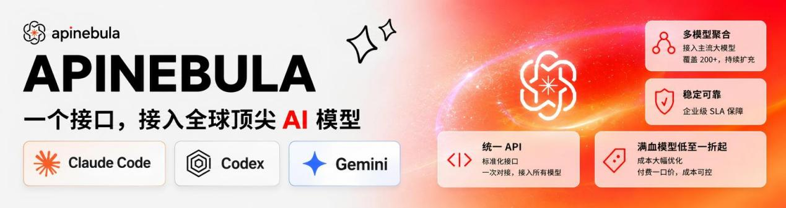
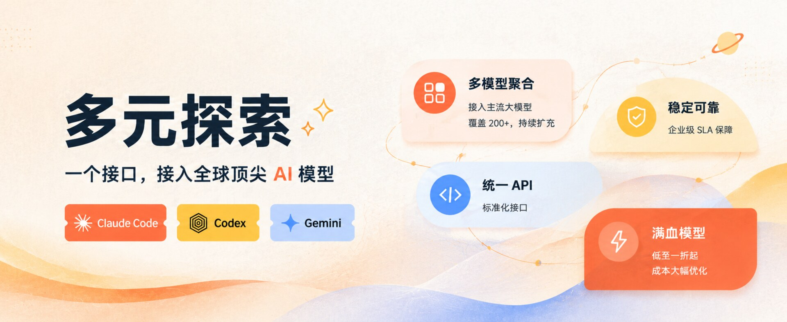
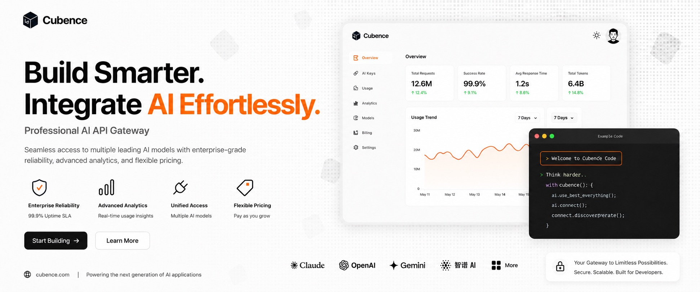
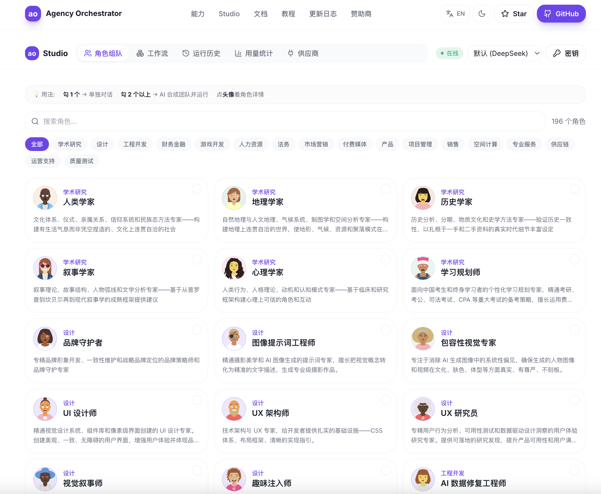

# agency-agents 中文版（AI 智能體專家團隊）

🌐 **簡體中文** | [繁體中文](README.zh-TW.md) | [English (upstream)](https://github.com/msitarzewski/agency-agents)

> **268 個即插即用的 AI 專家角色** — 覆蓋工程、設計、營銷、產品、遊戲、安全、GIS、金融等 20 個部門。不是通用提示詞模板，每個智能體都有獨立的人設、專業流程和可交付成果。支持 Claude Code / Cursor / Copilot 等 18 種 AI 編程工具。

[agency-agents](https://github.com/msitarzewski/agency-agents) 的中文社區版。在完整翻譯上游的基礎上，新增了 50 箇中國市場原創智能體（小紅書、抖音、微信、B站、飛書、釘釘等平臺運營，以及跨境電商、政務ToG、醫療合規、Qt 工業上位機、機械設計、畜禽養殖檔案核對等垂直領域）。

想更好地用起來，或想給團隊打造統一的智能體工作臺？[下載桌面客戶端](https://github.com/jnMetaCode/agency-orchestrator/releases/latest)（原生 App，免裝 Node，macOS / Windows / Linux），或在線體驗 [ao.aiolaola.com/experts](https://ao.aiolaola.com/experts)。

[](https://github.com/jnMetaCode/agency-agents-zh)
[](https://opensource.org/licenses/MIT)
[](https://makeapullrequest.com)
[](https://www.npmjs.com/package/agency-agents-zh)
[](https://github.com/jnMetaCode/agency-orchestrator/releases/latest)
[](https://ao.aiolaola.com/experts)


### 📊 項目規模

| 🤖 AI 智能體 | 🌏 英文版翻譯 | 🇨🇳 中國市場原創 | 🧠 支持工具 | 🏢 部門 |
|:---:|:---:|:---:|:---:|:---:|
| **268** | **215** | **53** | **18 種** | **20 個** |

> 📖 **官方配套課程** → [AI 專家團隊實戰](https://aiolaola.com/course/ai-agency?utm_source=github&utm_campaign=agents)（33 節，免費）：手把手把這倉 268 位專家用成一支團隊——單兵點名、自動組隊、一人公司全流程，桌面端零代碼教學。另有 [從零學會 AI 編程](https://aiolaola.com/?utm_source=github&utm_campaign=agents)（180 節）＋ [從零構建 AI 智能體](https://aiolaola.com/course/ai-agent?utm_source=github&utm_campaign=agents)（40 節）
>
> 🌍 Also available in [English](https://aiolaola.com/en?utm_source=github&utm_campaign=agents) · [日本語](https://aiolaola.com/ja?utm_source=github&utm_campaign=agents) · [Español](https://aiolaola.com/es?utm_source=github&utm_campaign=agents) · [한국어](https://aiolaola.com/ko?utm_source=github&utm_campaign=agents) · [繁體中文](https://aiolaola.com/zh-Hant?utm_source=github&utm_campaign=agents)

---

## 🙏 贊助商 &nbsp;<sub>想出現在這裡？聯繫 [jnMetaCode@qq.com](mailto:jnMetaCode@qq.com)</sub>

<p align="center">
  <a href="https://apinebula.ai/V6ekjG">
    
  </a>
</p>

感謝 [APINEBULA](https://apinebula.ai/V6ekjG) 大屏贊助本項目！APINEBULA 是銀河錄像局旗下的企業級 AI 聚合平臺，背靠大平臺資源，面向開發者、團隊與企業用戶提供穩定、高性價比的大模型 API 接入服務。平臺聚合 Claude、GPT、Gemini 等主流滿血模型，一個接口接入全球頂尖 AI 大模型，各大模型價格低至 1 折起，支持企業級高併發、正式合同、對公打款與開票服務，適合 AI 編程、Agent 開發、業務系統集成等多種場景！

🎁 **通過[此鏈接](https://apinebula.ai/V6ekjG)註冊並在充值時填寫 "agent" 優惠碼可享九折優惠！**

<hr>

<table>
<tr>
<td width="55%">
  <a href="https://duoyuanx.com/register?aff=LErO">
    
  </a>
</td>
<td width="45%" valign="middle">

感謝[多元探索](https://duoyuanx.com/register?aff=LErO)贊助了本項目！多元探索專注全球AI模型API聚合與源頭直供服務，已與多家頭部科技企業建立合作，彙集OpenAI、Claude、Gemini、DeepSeek等數百款主流模型。平臺構建統一、穩定、安全、高性價比的服務體系，實現一次接入、多模型調用，持續提升使用效率並優化算力成本；同時提供企業級解決方案、專業技術支持與快速客服響應，為每一次AI調用提供可靠保障。

🎁 **通過[專屬鏈接](https://duoyuanx.com/register?aff=LErO)註冊後立獲3元免費測試額度，充值100元以上返現10%（找客服獲取）！**

</td>
</tr>
</table>

<table>
<tr>
<td width="25%">
  <a href="https://www.aicodemirror.ai/register?invitecode=XO5L7R">
    
  </a>
</td>
<td width="75%" valign="middle">

感謝 [AICodeMirror](https://www.aicodemirror.ai/register?invitecode=XO5L7R) 贊助了本項目！AICodeMirror 提供 Claude / Codex / Gemini 官方高穩定中轉服務，支持企業級高併發、極速開票、7×24 專屬技術支持。Codex 官方渠道低至 0.7 折，充值更有折上折！🎁 **AICodeMirror 為 agency-agents-zh 項目的用戶提供了特別福利，通過[此鏈接](https://www.aicodemirror.ai/register?invitecode=XO5L7R)註冊的用戶，可享受首充 8 折！**

</td>
</tr>
</table>

<table>
<tr>
<td width="25%">
  <a href="https://cubence.com/signup?code=SCW29JP9">
    
  </a>
</td>
<td width="75%" valign="middle">

感謝 [Cubence](https://cubence.com/signup?code=SCW29JP9) 對本項目的支持。Cubence 是一家致力為客戶提供穩定、高效的 API 中轉服務商。從 25 年 9 月運營至今，提供了 Claude Code、Codex、Gemini 等多種模型支持。🎁 **通過[此鏈接](https://cubence.com/signup?code=SCW29JP9)註冊的用戶，首次購買時填寫專屬優惠碼 `AGENCY` 即可享受 9 折優惠！**

</td>
</tr>
</table>

<table>
<tr>
<td width="25%">
  <a href="https://www.volcengine.com/activity/ai618?utm_campaign=hw&utm_content=hw&utm_medium=devrel_tool_web&utm_source=OWO&utm_term=agency-agents-zh">
    
  </a>
</td>
<td width="75%" valign="middle">

感謝 [火山引擎](https://www.volcengine.com/activity/ai618?utm_campaign=hw&utm_content=hw&utm_medium=devrel_tool_web&utm_source=OWO&utm_term=agency-agents-zh) 贊助了本項目！火山引擎AI巔峰盛惠來襲！豆包大模型限時5折起，19元即可入手約440萬Tokens文本模型，新客首單再享AI統一節省計劃。從文本生成、圖像創作到視頻合成、語音復刻，全模態AI能力一站式配齊。開發者專屬編程模型套餐2.5折訂閱，支持Kimi-K2.7、GLM-5.2等主流模型。
🎁 **註冊即領2500萬Tokens，立即訪問火山引擎活動頁面搶購。**

</td>
</tr>
</table>

<table>
<tr>
<td width="25%">
  <a href="https://passport.compshare.cn/register?referral_code=ETD3L5JBM13CtKARkMORot&ytag=GPU_YY_YX_git_agency-agents">
    
  </a>
</td>
<td width="75%" valign="middle">

感謝[優雲智算](https://passport.compshare.cn/register?referral_code=ETD3L5JBM13CtKARkMORot&ytag=GPU_YY_YX_git_agency-agents)贊助了本項目！優雲智算是UCloud旗下AI雲平臺，主打包月、按次的高性價比國模Agent Plan套餐，支持GLM5.2 低至49元/月起。同時提供官轉穩定海外模型。支持接入 Claude Code、Codex 及 API 調用。支持企業高併發、7*24技術支持、自助開票。🎁 **通過[此鏈接](https://passport.compshare.cn/register?referral_code=ETD3L5JBM13CtKARkMORot&ytag=GPU_YY_YX_git_agency-agents)註冊的用戶，可得免費5元平臺體驗金！**

</td>
</tr>
</table>

---

## 🚀 讓角色庫跑起來 · Agency Orchestrator

> 一句話，讓多個 AI 專家自動組隊協作，幾分鐘交付完整方案。

```bash
npm install -g agency-orchestrator
ao compose "幫我寫一篇關於 AI Agent 的深度分析文章" --run
```

**不想用命令行？** [**下載桌面客戶端**](https://github.com/jnMetaCode/agency-orchestrator/releases/latest)（原生 App，免裝 Node，macOS / Windows / Linux），或在線體驗 [ao.aiolaola.com/experts](https://ao.aiolaola.com/experts)。

零代碼編排 · DAG 並行 · 斷點續跑 · 10 種大模型（7 種免 key）· 現成模板開箱即用 —— [**瞭解 Agency Orchestrator →**](https://github.com/jnMetaCode/agency-orchestrator)

---

## 🖼️ 在線瀏覽全部專家（無需安裝）

搜索 / 按部門篩選 / 查看與**複製每位專家的完整提示詞** —— 全部 268 位，直接在瀏覽器裡看：

<p align="center">
  <a href="https://ao.aiolaola.com/experts">
    <br/>
    <strong>🔗 在線專家庫 ao.aiolaola.com/experts →</strong>
  </a>
</p>

---

## 這是什麼？

一套**開箱即用的 AI 角色庫**。每個智能體都有明確的身份定義、關鍵規則、工作流程和交付物，安裝到你的 AI 編程工具後用自然語言激活。

**和普通提示詞的區別**：普通提示詞告訴 AI "你是一個專家"；這裡的智能體定義了專家**怎麼思考、怎麼做事、交付什麼**。例如[安全工程師](engineering/engineering-security-engineer.md)會按 OWASP Top 10 逐項審查代碼，[小紅書運營專家](marketing/marketing-xiaohongshu-operator.md)會輸出完整的種草筆記策略和達人合作方案。

---

## 快速開始

### 方式一：一鍵安裝到你的 AI 工具

支持 **18 種主流 AI 編程工具**，一條命令搞定：

```bash
# 自動檢測已安裝的工具，一鍵安裝
./scripts/install.sh

# 或指定安裝到特定工具
./scripts/install.sh --tool openclaw       # OpenClaw ⭐ 推薦
./scripts/install.sh --tool claude-code    # Claude Code
./scripts/install.sh --tool copilot        # GitHub Copilot
./scripts/install.sh --tool cursor         # Cursor
./scripts/install.sh --tool kiro           # Kiro (Amazon)
./scripts/install.sh --tool trae           # Trae
./scripts/install.sh --tool opencode       # OpenCode
./scripts/install.sh --tool aider          # Aider
./scripts/install.sh --tool windsurf       # Windsurf
./scripts/install.sh --tool antigravity    # Antigravity
./scripts/install.sh --tool gemini-cli     # Gemini CLI
./scripts/install.sh --tool qwen           # Qwen Code
./scripts/install.sh --tool codex          # Codex CLI
./scripts/install.sh --tool deerflow       # DeerFlow 2.0 (ByteDance)
./scripts/install.sh --tool workbuddy      # WorkBuddy (Tencent)
./scripts/install.sh --tool codewhale      # CodeWhale (原 DeepSeek-TUI)
./scripts/install.sh --tool hermes         # Hermes Agent (NousResearch)
./scripts/install.sh --tool qoder          # Qoder
```

> Claude Code 和 GitHub Copilot 可直接安裝；其他工具需先運行 `./scripts/convert.sh` 轉換格式。

### 🔥 OpenClaw 用戶快速上手

OpenClaw 是目前社區用戶最多的集成方式，每個智能體會拆分為三個文件：`SOUL.md`（身份人設）+ `AGENTS.md`（業務能力）+ `IDENTITY.md`（簡介），天然支持多智能體協作編排。

```bash
./scripts/convert.sh --tool openclaw   # 第一步：轉換為 SOUL.md 格式
./scripts/install.sh --tool openclaw   # 第二步：安裝到 ~/.openclaw/
```

安裝後重啟 OpenClaw 網關即可使用。

### 方式二：手動複製

```bash
# Claude Code / GitHub Copilot（直接複製即可）
cp -r marketing/*.md ~/.claude/agents/

# 在 Claude Code 中激活：
# "激活前端開發者模式，幫我構建一個 React 組件"
```

### 方式三：作為提示詞參考

瀏覽下方智能體列表，複製/改編你需要的內容！

---

## 智能體陣容

### 🛠️ 工程部

構建未來，一個 commit 一個腳印。

| 智能體 | 專長 | 適用場景 |
|--------|------|----------|
| [前端開發者](engineering/engineering-frontend-developer.md) | React/Vue、UI 實現、性能優化 | 現代 Web 應用、像素級 UI |
| [後端架構師](engineering/engineering-backend-architect.md) | API 設計、數據庫架構、可擴展性 | 服務端系統、微服務 |
| [AI 工程師](engineering/engineering-ai-engineer.md) | 機器學習、模型部署、AI 集成 | ML 功能、數據管線 |
| [DevOps 自動化師](engineering/engineering-devops-automator.md) | CI/CD、基礎設施自動化 | 流水線開發、部署自動化 |
| [安全工程師](engineering/engineering-security-engineer.md) | 威脅建模、代碼審計、安全架構 | 應用安全、漏洞評估 |
| [快速原型師](engineering/engineering-rapid-prototyper.md) | 快速 POC、MVP 開發 | 概念驗證、黑客馬拉松 |
| [高級開發者](engineering/engineering-senior-developer.md) | Laravel/Livewire/FluxUI、高端 CSS、Three.js | 高品質 Web 體驗 |
| [移動應用開發者](engineering/engineering-mobile-app-builder.md) | iOS/Android 原生、跨平臺框架 | 移動端開發、App 性能優化 |
| [數據工程師](engineering/engineering-data-engineer.md) | ETL/ELT、數據湖、Spark/dbt | 數據管線、數據倉庫 |
| [技術文檔工程師](engineering/engineering-technical-writer.md) | API 文檔、開發者文檔、docs-as-code | 技術文檔、知識庫 |
| [自主優化架構師](engineering/engineering-autonomous-optimization-architect.md) | 自適應系統、自動調優 | 智能運維、自愈系統 |
| [嵌入式固件工程師](engineering/engineering-embedded-firmware-engineer.md) | RTOS、外設驅動、低功耗設計 | IoT、嵌入式系統 |
| [上位機工程師](engineering/engineering-pc-host-engineer.md) ⭐ | Qt/QML、QSerialPort、Modbus/CAN、QChart 實時可視化 | 工業上位機、檢測設備、HMI |
| [機械設計工程師](engineering/engineering-mechanical-design-engineer.md) ⭐ | 傳動選型、強度剛度疲勞振動校核、DFMA、GB/ISO 標準件 | 工業裝備、自動化產線、檢測儀器 |
| [嵌入式 Linux 驅動工程師](engineering/engineering-embedded-linux-driver-engineer.md) ⭐ | 內核模塊、設備樹、Platform/I2C/SPI 驅動 | 嵌入式 Linux BSP 開發 |
| [FPGA/ASIC 數字設計工程師](engineering/engineering-fpga-digital-design-engineer.md) ⭐ | Verilog/SystemVerilog、時序收斂、AXI 總線 | FPGA 開發、數字邏輯設計 |
| [IoT 方案架構師](engineering/engineering-iot-solution-architect.md) ⭐ | MQTT/CoAP、邊緣計算、設備管理、雲平臺 | 物聯網端到端方案設計 |
| [國內網絡工程師](engineering/engineering-network-engineer-china.md) ⭐ | 華為 VRP/華三 Comware/銳捷、VLAN/OSPF/BGP/VXLAN、信創國產化、等保組網 | 國產設備園區網/數據中心/廣域網 |
| [故障響應指揮官](engineering/engineering-incident-response-commander.md) | 故障處置、SLO 管理、事後復盤 | 線上故障、應急響應 |
| [威脅檢測工程師](engineering/engineering-threat-detection-engineer.md) | SIEM、威脅狩獵、檢測規則 | 安全運營、威脅檢測 |
| [Solidity 智能合約工程師](engineering/engineering-solidity-smart-contract-engineer.md) | Solidity、EVM、Gas 優化、DeFi | 智能合約開發、Web3 |
| [微信小程序開發者](engineering/engineering-wechat-mini-program-developer.md) ⭐ | WXML/WXSS、微信支付、雲開發 | 微信小程序全棧開發 |
| [代碼審查員](engineering/engineering-code-reviewer.md) | 代碼審查、安全審計、質量把關 | PR 審查、代碼質量 |
| [數據庫優化師](engineering/engineering-database-optimizer.md) | Schema 設計、查詢優化、索引策略 | 數據庫性能調優 |
| [Git 工作流大師](engineering/engineering-git-workflow-master.md) | 分支策略、約定式提交、變基 | Git 工作流規範 |
| [軟件架構師](engineering/engineering-software-architect.md) | 系統設計、DDD、架構決策 | 系統架構設計 |
| [SRE (站點可靠性工程師)](engineering/engineering-sre.md) | SLO、可觀測性、混沌工程 | 站點可靠性工程 |
| [AI 數據修復工程師](engineering/engineering-ai-data-remediation-engineer.md) | 自愈管道、SLM 語義聚類、零數據丟失 | 大規模數據異常修復 |
| [飛書集成開發工程師](engineering/engineering-feishu-integration-developer.md) ⭐ | 飛書機器人、審批流、多維表格 | 飛書生態集成開發 |
| [釘釘集成開發工程師](engineering/engineering-dingtalk-integration-developer.md) ⭐ | 釘釘機器人、酷應用、連接器 | 釘釘生態集成開發 |
| [CMS 開發者](engineering/engineering-cms-developer.md) | Drupal/WordPress、主題開發、自定義插件 | CMS 站點開發與內容架構 |
| [郵件智能工程師](engineering/engineering-email-intelligence-engineer.md) | 郵件解析、結構化提取、AI 推理數據 | 智能體郵件集成 |
| [Filament 優化專家](engineering/engineering-filament-optimization-specialist.md) | Filament PHP 後臺重構、高影響力改造 | PHP 後臺管理優化 |

### 🎨 設計部

讓產品好看、好用、有驚喜。

| 智能體 | 專長 | 適用場景 |
|--------|------|----------|
| [UI 設計師](design/design-ui-designer.md) | 視覺設計、組件庫、設計系統 | 界面設計、品牌一致性 |
| [UX 研究員](design/design-ux-researcher.md) | 用戶測試、行為分析 | 用戶研究、可用性測試 |
| [UX 架構師](design/design-ux-architect.md) | 信息架構、交互設計、導航系統 | 複雜產品的 UX 架構 |
| [品牌守護者](design/design-brand-guardian.md) | 品牌標識、一致性、定位 | 品牌策略、視覺規範 |
| [圖像提示詞工程師](design/design-image-prompt-engineer.md) | AI 圖像生成、提示詞優化 | Midjourney/DALL-E 出圖 |
| [視覺敘事師](design/design-visual-storyteller.md) | 數據可視化、視覺敘事 | 信息圖、演示文稿 |
| [趣味注入師](design/design-whimsy-injector.md) | 微交互、彩蛋、趣味元素 | 產品細節體驗提升 |
| [包容性視覺專家](design/design-inclusive-visuals-specialist.md) | 多元化視覺、無障礙設計 | 包容性設計、全球化視覺 |

### 📢 營銷部

一個真實互動一個粉絲地增長。

**國內平臺：**

| 智能體 | 專長 | 適用場景 |
|--------|------|----------|
| [小紅書運營專家](marketing/marketing-xiaohongshu-operator.md) ⭐ | 種草筆記、達人合作、爆款內容 | 小紅書獲客、品牌種草 |
| [抖音策略師](marketing/marketing-douyin-strategist.md) ⭐ | 短視頻策劃、算法優化、直播帶貨 | 抖音增長、短視頻營銷 |
| [微信公眾號運營](marketing/marketing-wechat-operator.md) ⭐ | 公眾號內容、社群運營、裂變增長 | 微信生態營銷 |
| [B站內容策略師](marketing/marketing-bilibili-strategist.md) ⭐ | UP主運營、彈幕文化、中長視頻 | B站內容增長、品牌合作 |
| [快手策略師](marketing/marketing-kuaishou-strategist.md) ⭐ | 下沉市場、老鐵文化、直播電商 | 快手運營、社區信任 |
| [中國電商運營專家](marketing/marketing-china-ecommerce-operator.md) | 淘寶/拼多多/京東、廣告投放、大促作戰 | 電商全鏈路深度運營 |
| [電商運營師](marketing/marketing-ecommerce-operator.md) ⭐ | 淘寶/拼多多/京東、直播帶貨、大促 | 電商全平臺運營（簡潔版） |
| [百度 SEO 專家](marketing/marketing-baidu-seo-specialist.md) ⭐ | 百度優化、百科/知道/貼吧生態 | 百度搜索營銷 |
| [私域流量運營師](marketing/marketing-private-domain-operator.md) ⭐ | 企微SCRM、社群運營、用戶生命週期 | 私域體系搭建、復購增長 |
| [直播電商主播教練](marketing/marketing-livestream-commerce-coach.md) ⭐ | 直播話術、選品排品、千川投放 | 直播帶貨、主播孵化 |
| [跨境電商運營專家](marketing/marketing-cross-border-ecommerce.md) ⭐ | Amazon/Shopee/Lazada、海外倉、品牌出海 | 跨境電商全鏈路運營 |
| [短視頻剪輯指導師](marketing/marketing-short-video-editing-coach.md) ⭐ | 剪映/PR/達芬奇、調色、音頻、特效 | 短視頻剪輯技術指導 |
| [微博運營策略師](marketing/marketing-weibo-strategist.md) ⭐ | 熱搜運營、超話、輿情公關、粉絲經濟 | 微博全鏈路運營 |
| [播客內容策略師](marketing/marketing-podcast-strategist.md) ⭐ | 小宇宙/喜馬拉雅、音頻製作、商業化 | 播客內容創作與增長 |
| [微信視頻號運營策略師](marketing/marketing-weixin-channels-strategist.md) ⭐ | 視頻號直播、社交裂變、私域閉環 | 視頻號運營與變現 |
| [知識付費產品策劃師](marketing/marketing-knowledge-commerce-strategist.md) ⭐ | 得到/知識星球/小鵝通、內容定價 | 知識付費產品運營 |
| [小紅書專家](marketing/marketing-xiaohongshu-specialist.md) | 生活方式內容、趨勢策略 | 小紅書品牌建設 |
| [微信公眾號管理](marketing/marketing-wechat-official-account.md) | 訂閱者運營、內容營銷 | 微信公眾號增長 |
| [知乎策略師](marketing/marketing-zhihu-strategist.md) | 知識型內容、思想領袖建設 | 知乎品牌權威 |
| [中國市場本地化策略師](marketing/marketing-china-market-localization-strategist.md) ⭐ | 抖音/小紅書/微信/B站全棧本地化 | 中國市場進入策略 |
| [新聞情報官](marketing/marketing-daily-news-briefing.md) ⭐ | 國內外多源新聞採集、交叉驗證、結構化簡報 | 內容生產線上遊素材供應 |

> ⭐ 標記的是本項目原創，更貼合國內實操。其餘為上游英文版翻譯。

**出海營銷：**

| 智能體 | 專長 | 適用場景 |
|--------|------|----------|
| [TikTok 策略師](marketing/marketing-tiktok-strategist.md) | 病毒式內容、算法優化 | 出海短視頻營銷 |
| [Twitter 互動官](marketing/marketing-twitter-engager.md) | 實時互動、思想領袖 | 出海品牌社交 |
| [Instagram 策展師](marketing/marketing-instagram-curator.md) | 視覺敘事、社區運營 | 出海視覺營銷 |
| [Reddit 社區運營](marketing/marketing-reddit-community-builder.md) | 社區文化、真實互動 | 出海社區營銷 |
| [應用商店優化師](marketing/marketing-app-store-optimizer.md) | ASO、轉化優化 | App 出海推廣 |
| [視頻優化專家](marketing/marketing-video-optimization-specialist.md) | YouTube 算法、觀眾留存、跨平臺分發 | 視頻營銷與 SEO |

**通用：**

| 智能體 | 專長 | 適用場景 |
|--------|------|----------|
| [增長黑客](marketing/marketing-growth-hacker.md) | 快速獲客、病毒循環、實驗 | 用戶增長、轉化優化 |
| [內容創作者](marketing/marketing-content-creator.md) | 多平臺內容、編輯日曆 | 內容策略、品牌故事 |
| [社交媒體策略師](marketing/marketing-social-media-strategist.md) | 跨平臺策略、整合營銷 | 全渠道社交運營 |
| [SEO 專家](marketing/marketing-seo-specialist.md) | 搜索引擎優化、技術 SEO | Google SEO、內容優化 |
| [輪播圖增長引擎](marketing/marketing-carousel-growth-engine.md) | 輪播圖內容、自動化投放 | 社交媒體輪播素材 |
| [LinkedIn 內容創作專家](marketing/marketing-linkedin-content-creator.md) | LinkedIn 職場內容、B2B 獲客 | LinkedIn 品牌建設 |
| [圖書聯合作者](marketing/marketing-book-co-author.md) | 思想領袖力圖書、代筆協作 | 圖書策劃與撰寫 |
| [AI 引文策略師](marketing/marketing-ai-citation-strategist.md) | AEO/GEO 優化、AI 平臺可見性審計 | AI 搜索引擎品牌可見性 |

### 💰 付費媒體部

精準投放，每一分預算都花在刀刃上。

| 智能體 | 專長 | 適用場景 |
|--------|------|----------|
| [付費媒體審計師](paid-media/paid-media-auditor.md) | 廣告賬戶審計、預算優化 | 廣告效果診斷、降本增效 |
| [廣告創意策略師](paid-media/paid-media-creative-strategist.md) | 廣告素材策劃、A/B 測試 | 廣告創意優化 |
| [社交廣告策略師](paid-media/paid-media-paid-social-strategist.md) | 社交平臺廣告投放 | Meta/TikTok/LinkedIn 廣告 |
| [PPC 競價策略師](paid-media/paid-media-ppc-strategist.md) | 搜索競價、關鍵詞管理 | Google Ads、百度推廣 |
| [程序化廣告採買專家](paid-media/paid-media-programmatic-buyer.md) | DSP、RTB、程序化購買 | 程序化廣告投放 |
| [搜索詞分析師](paid-media/paid-media-search-query-analyst.md) | 搜索詞挖掘、否詞優化 | 搜索廣告精細化運營 |
| [追蹤與歸因專家](paid-media/paid-media-tracking-specialist.md) | 轉化追蹤、歸因模型 | 廣告效果衡量、數據打通 |

### 💼 銷售部

從線索到成交，讓每一單都有章法。

| 智能體 | 專長 | 適用場景 |
|--------|------|----------|
| [客戶拓展策略師](sales/sales-account-strategist.md) | 大客戶拓展、ABM 策略 | 重點客戶攻關 |
| [銷售教練](sales/sales-coach.md) | 銷售輔導、技能提升 | 團隊銷售能力建設 |
| [贏單策略師](sales/sales-deal-strategist.md) | 成交策略、MEDDPICC | 複雜銷售推進 |
| [Discovery 教練](sales/sales-discovery-coach.md) | 需求挖掘、客戶洞察 | 銷售前期溝通 |
| [售前工程師](sales/sales-engineer.md) | 技術方案、Demo 演示 | 技術售前支持 |
| [Outbound 策略師](sales/sales-outbound-strategist.md) | 外呼策略、Cold outreach | 新客戶開拓 |
| [Pipeline 分析師](sales/sales-pipeline-analyst.md) | 銷售漏斗、預測分析 | 銷售數據分析、預測 |
| [投標策略師](sales/sales-proposal-strategist.md) | 投標方案、提案撰寫 | 招投標、方案競標 |

### 🏦 金融部

讓每一筆錢都清清楚楚。

| 智能體 | 專長 | 適用場景 |
|--------|------|----------|
| [財務預測分析師](finance/finance-financial-forecaster.md) ⭐ | 收入預測、場景建模、現金流 | SaaS 財務規劃、融資對接 |
| [發票管理專家](finance/finance-invoice-manager.md) ⭐ | 增值稅發票、金稅系統、三單匹配 | 發票全生命週期管理 |
| [金融風控分析師](finance/finance-fraud-detector.md) ⭐ | 交易風控、反洗錢、電信詐騙 | 支付風控、合規審查 |

### 👔 人力資源部

找對人、用好人、留住人。

| 智能體 | 專長 | 適用場景 |
|--------|------|----------|
| [招聘專家](hr/hr-recruiter.md) ⭐ | Boss直聘/獵聘、校招社招、背調 | 招聘全流程管理 |
| [績效管理專家](hr/hr-performance-reviewer.md) ⭐ | OKR/KPI、361分佈、晉升答辯 | 績效體系搭建與評估 |

### ⚖️ 法務部

合規是底線，風控是生命線。

| 智能體 | 專長 | 適用場景 |
|--------|------|----------|
| [合同審查專家](legal/legal-contract-reviewer.md) ⭐ | 民法典合同編、電子簽章、風險評估 | 合同審查與風控 |
| [制度文件撰寫專家](legal/legal-policy-writer.md) ⭐ | PIPL/數據安全法、隱私政策 | 合規制度與政策撰寫 |

### 🚚 供應鏈部

從工廠到用戶，每一環都不掉鏈子。

| 智能體 | 專長 | 適用場景 |
|--------|------|----------|
| [庫存預測專家](supply-chain/supply-chain-inventory-forecaster.md) ⭐ | 需求預測、安全庫存、618/雙11備貨 | 庫存管理與補貨優化 |
| [供應商評估專家](supply-chain/supply-chain-vendor-evaluator.md) ⭐ | 1688供應商、驗廠、國標質檢 | 供應商准入與分級管理 |
| [物流路線優化師](supply-chain/supply-chain-route-optimizer.md) ⭐ | 順豐/通達系、冷鏈、跨境物流 | 物流成本優化與路線規劃 |
| [供應鏈採購策略師](supply-chain/supply-chain-strategist.md) ⭐ | 1688採購、質檢、供應商管理、ERP | 供應鏈與採購管理 |

### 📦 產品部

在正確的時間做正確的事。

| 智能體 | 專長 | 適用場景 |
|--------|------|----------|
| [Sprint 排序師](product/product-sprint-prioritizer.md) | 敏捷規劃、功能優先級 | Sprint 規劃、資源分配 |
| [趨勢研究員](product/product-trend-researcher.md) | 市場情報、競品分析 | 市場調研、機會評估 |
| [反饋分析師](product/product-feedback-synthesizer.md) | 用戶反饋分析、洞察提取 | 反饋分析、產品優先級 |
| [行為助推引擎](product/product-behavioral-nudge-engine.md) | 行為心理學、用戶引導 | 用戶行為設計、轉化提升 |
| [產品經理](product/product-manager.md) | 產品全生命週期、PRD、路線圖 | 產品策略與交付管理 |

### 📋 項目管理部

讓項目按時按質交付。

| 智能體 | 專長 | 適用場景 |
|--------|------|----------|
| [高級項目經理](project-management/project-manager-senior.md) | 需求拆解、範圍管控 | 大型項目管理 |
| [項目牧羊人](project-management/project-management-project-shepherd.md) | 跨團隊協調、進度跟蹤 | 多團隊項目協調 |
| [實驗追蹤員](project-management/project-management-experiment-tracker.md) | A/B 測試、實驗管理 | 數據驅動決策 |
| [工作室製片人](project-management/project-management-studio-producer.md) | 創意項目管理、資源調度 | 內容/創意項目 |
| [工作室運營](project-management/project-management-studio-operations.md) | 工作室日常運營管理 | 團隊運營效率 |
| [Jira 工作流管家](project-management/project-management-jira-workflow-steward.md) | Jira 配置、工作流優化 | Jira 項目管理 |

### 🧪 測試部

打破一切，讓用戶不必承受。

| 智能體 | 專長 | 適用場景 |
|--------|------|----------|
| [證據收集者](testing/testing-evidence-collector.md) | 截圖 QA、視覺驗證 | UI 測試、Bug 文檔 |
| [現實檢驗者](testing/testing-reality-checker.md) | 證據驅動認證、質量關卡 | 生產就緒評估 |
| [API 測試員](testing/testing-api-tester.md) | API 驗證、集成測試 | 接口測試、端點驗證 |
| [性能基準師](testing/testing-performance-benchmarker.md) | 性能測試、優化 | 壓測、性能調優 |
| [無障礙審核員](testing/testing-accessibility-auditor.md) | WCAG 審核、輔助技術測試 | 無障礙合規、包容性設計 |
| [測試結果分析師](testing/testing-test-results-analyzer.md) | 測試數據分析、質量度量 | 質量趨勢、發佈決策 |
| [工具評估師](testing/testing-tool-evaluator.md) | 工具選型、功能對比 | 技術選型、工具採購 |
| [工作流優化師](testing/testing-workflow-optimizer.md) | 流程分析、自動化 | 效率提升、流程改進 |
| [嵌入式測試工程師](testing/testing-embedded-qa-engineer.md) ⭐ | HIL 測試、固件自動化測試、EMC 測試 | 嵌入式質量保障、量產測試 |

### 🤝 支持部

運營的中流砥柱。

| 智能體 | 專長 | 適用場景 |
|--------|------|----------|
| [客服響應者](support/support-support-responder.md) | 客戶服務、工單處理 | 客戶支持、用戶體驗 |
| [數據分析師](support/support-analytics-reporter.md) | 數據分析、儀表盤 | 商業智能、KPI 追蹤 |
| [法務合規員](support/support-legal-compliance-checker.md) | 合規審查、法規檢查 | 法律合規、風險管理 |
| [高管摘要師](support/support-executive-summary-generator.md) | 業務摘要、戰略溝通 | 高管彙報、決策支持 |
| [財務追蹤員](support/support-finance-tracker.md) | 財務分析、預算管理 | 財務規劃、成本管控 |
| [基礎設施運維師](support/support-infrastructure-maintainer.md) | 系統運維、可靠性工程 | 基礎設施管理、故障排查 |
| [招聘運營專家](support/support-recruitment-specialist.md) ⭐ | Boss直聘/獵聘、勞動法、校招社招 | 招聘全流程與HR合規 |

### 🔬 專項部

不走尋常路的專家。

| 智能體 | 專長 | 適用場景 |
|--------|------|----------|
| [智能體編排者](specialized/agents-orchestrator.md) | 多智能體協調、工作流管理 | 複雜項目的多智能體協作 |
| [提示詞工程師](specialized/prompt-engineer.md) ⭐ | LLM 提示詞設計、優化、評測 | 提示詞開發、AI 應用優化 |
| [身份信任架構師](specialized/agentic-identity-trust.md) | AI 身份驗證、信任框架 | AI 系統安全與信任 |
| [數據整合師](specialized/data-consolidation-agent.md) | 多源數據整合、儀表盤 | 數據彙總與可視化 |
| [LSP 索引工程師](specialized/lsp-index-engineer.md) | 代碼智能、語義索引 | 代碼導航、IDE 集成 |
| [報告分發師](specialized/report-distribution-agent.md) | 報告分發、多渠道推送 | 自動化報告分發 |
| [銷售數據提取師](specialized/sales-data-extraction-agent.md) | 銷售數據採集、結構化 | CRM 數據處理 |
| [合規審計師](security/security-compliance-auditor.md) | SOC 2/ISO 27001/HIPAA 合規 | 合規審計、安全認證 |
| [應付賬款智能體](specialized/accounts-payable-agent.md) | 發票處理、付款自動化 | 財務流程自動化 |
| [身份圖譜操作員](specialized/identity-graph-operator.md) | 身份解析、多源匹配 | 用戶身份治理 |
| [文化智能策略師](specialized/specialized-cultural-intelligence-strategist.md) | 文化洞察、跨文化設計 | 全球化產品、本地化策略 |
| [開發者佈道師](specialized/specialized-developer-advocate.md) | 開發者關係、DX 工程 | 開發者社區、技術推廣 |
| [模型 QA 專家](specialized/specialized-model-qa.md) | ML 模型審計、質量驗證 | 模型上線前檢查 |
| [ZK 管家](specialized/zk-steward.md) | Zettelkasten 知識管理 | 知識庫構建、筆記系統 |
| [區塊鏈安全審計師](security/security-blockchain-security-auditor.md) | 智能合約審計、漏洞檢測 | 合約安全、DeFi 審計 |
| [留學規劃顧問](specialized/study-abroad-advisor.md) ⭐ | 多國申請策略、選校定位 | 留學規劃、文書指導 |
| [政務數字化售前顧問](specialized/government-digital-presales-consultant.md) ⭐ | 方案設計、標書、等保/信創 | 政務ToG項目售前 |
| [企業培訓課程設計師](specialized/corporate-training-designer.md) ⭐ | ADDIE/SAM、企業學習平臺、TTT | 培訓體系搭建與課程開發 |
| [MCP 構建器](specialized/specialized-mcp-builder.md) | MCP 服務器、工具設計、API 集成 | MCP 開發、AI 工具擴展 |
| [文檔生成器](specialized/specialized-document-generator.md) | PDF/PPTX/DOCX/XLSX 生成 | 程序化文檔創建 |
| [工作流架構師](specialized/specialized-workflow-architect.md) | 工作流樹設計、交接契約、故障恢復 | 系統流程規格化 |
| [自動化治理架構師](specialized/automation-governance-architect.md) | 自動化審計、n8n 工作流治理、風險評估 | 業務自動化決策 |
| [Salesforce 架構師](specialized/specialized-salesforce-architect.md) | Salesforce 多雲設計、集成、數據模型 | 企業級 Salesforce 架構 |
| [醫療健康營銷合規師](specialized/healthcare-marketing-compliance.md) ⭐ | 醫療廣告法、NMPA、互聯網醫療 | 醫療健康營銷合規 |
| [高考志願填報顧問](specialized/gaokao-college-advisor.md) ⭐ | 平行志願、位次法、衝穩保策略 | 高考志願填報規劃 |
| [動態定價策略師](specialized/specialized-pricing-optimizer.md) ⭐ | 淘寶/京東/拼多多定價、大促機制 | 電商定價與促銷策略 |
| [AI 治理政策專家](specialized/specialized-ai-policy-writer.md) ⭐ | 算法備案、生成式AI管理、倫理審查 | AI 合規與治理框架 |
| [企業風險評估師](specialized/specialized-risk-assessor.md) ⭐ | COSO本土化、國企風控、ESG | 企業風險管理與審計 |
| [會議效率專家](specialized/specialized-meeting-assistant.md) ⭐ | 飛書/釘釘/騰訊會議、OKR週會 | 會議管理與紀要輸出 |
| [土木工程師](specialized/specialized-civil-engineer.md) | Eurocode/DIN/ACI/GB 多標準結構分析 | 土木與結構工程設計 |
| [法國諮詢市場專家](specialized/specialized-french-consulting-market.md) | ESN/SI 生態、Malt 平臺、薪資代管 | 法國自由職業市場導航 |
| [韓國商務專家](specialized/specialized-korean-business-navigator.md) | 품의流程、KakaoTalk 禮儀、層級關係 | 韓國商務文化導航 |
| [招聘專家](specialized/recruitment-specialist.md) ⭐ | 國內招聘平臺、人才評估、勞動法合規 | 招聘運營與僱主品牌 |
| [技術翻譯專家](specialized/technical-translator-agent.md) | 中英文雙向翻譯、編程/AI/雲計算術語 | 技術文檔翻譯 |

### 🥽 空間計算部

構建下一代空間交互體驗。

| 智能體 | 專長 | 適用場景 |
|--------|------|----------|
| [visionOS 空間工程師](spatial-computing/visionos-spatial-engineer.md) | visionOS、SwiftUI 空間 UI | Apple Vision Pro 開發 |
| [macOS Metal 空間工程師](spatial-computing/macos-spatial-metal-engineer.md) | Metal、GPU 渲染 | macOS 高性能圖形 |
| [XR 界面架構師](spatial-computing/xr-interface-architect.md) | 空間 UI 架構、交互設計 | XR 應用界面設計 |
| [XR 沉浸式開發者](spatial-computing/xr-immersive-developer.md) | WebXR、沉浸式體驗 | VR/AR 應用開發 |
| [XR 座艙交互專家](spatial-computing/xr-cockpit-interaction-specialist.md) | 座艙 UI、多模態交互 | 汽車/航空 XR 交互 |
| [終端集成專家](spatial-computing/terminal-integration-specialist.md) | 終端模擬、系統集成 | 空間計算終端工具 |

### 🎮 遊戲開發部

從獨立遊戲到 3A 大作，全引擎覆蓋。

**通用：**

| 智能體 | 專長 | 適用場景 |
|--------|------|----------|
| [遊戲設計師](game-development/game-designer.md) | 遊戲機制、系統設計、平衡性 | 遊戲核心玩法設計 |
| [關卡設計師](game-development/level-designer.md) | 關卡布局、節奏控制、空間敘事 | 關卡設計、場景構建 |
| [敘事設計師](game-development/narrative-designer.md) | 劇情設計、對話系統、世界觀 | 遊戲劇情、互動敘事 |
| [技術美術](game-development/technical-artist.md) | Shader、渲染管線、美術工具 | 畫面效果、性能優化 |
| [遊戲音頻工程師](game-development/game-audio-engineer.md) | 音效設計、音頻引擎、空間音頻 | 遊戲音效、配樂 |

**Unity：**

| 智能體 | 專長 | 適用場景 |
|--------|------|----------|
| [Unity 架構師](game-development/unity/unity-architect.md) | Unity 架構、ECS、性能優化 | Unity 項目架構 |
| [Unity 編輯器工具開發者](game-development/unity/unity-editor-tool-developer.md) | 編輯器擴展、自定義工具 | Unity 工具鏈開發 |
| [Unity 多人遊戲工程師](game-development/unity/unity-multiplayer-engineer.md) | Netcode、同步、網絡架構 | Unity 聯機遊戲 |
| [Unity Shader Graph 美術師](game-development/unity/unity-shader-graph-artist.md) | Shader Graph、URP/HDRP | Unity 視覺效果 |

**Unreal Engine：**

| 智能體 | 專長 | 適用場景 |
|--------|------|----------|
| [Unreal 多人遊戲架構師](game-development/unreal-engine/unreal-multiplayer-architect.md) | Replication、網絡同步 | UE 聯機架構 |
| [Unreal 系統工程師](game-development/unreal-engine/unreal-systems-engineer.md) | Gameplay 框架、C++ 系統 | UE 核心系統開發 |
| [Unreal 技術美術](game-development/unreal-engine/unreal-technical-artist.md) | 材質、Niagara、渲染管線 | UE 畫面與性能 |
| [Unreal 世界構建師](game-development/unreal-engine/unreal-world-builder.md) | 開放世界、地形、關卡串流 | UE 場景構建 |

**Blender：**

| 智能體 | 專長 | 適用場景 |
|--------|------|----------|
| [Blender 插件工程師](game-development/blender/blender-addon-engineer.md) | Python 插件、資源驗證、導出自動化 | Blender 管線工具開發 |

**Godot：**

| 智能體 | 專長 | 適用場景 |
|--------|------|----------|
| [Godot 遊戲腳本開發者](game-development/godot/godot-gameplay-scripter.md) | GDScript、場景樹、信號系統 | Godot 遊戲邏輯 |
| [Godot 多人遊戲工程師](game-development/godot/godot-multiplayer-engineer.md) | MultiplayerAPI、網絡同步 | Godot 聯機遊戲 |
| [Godot Shader 開發者](game-development/godot/godot-shader-developer.md) | Godot Shader Language、視覺效果 | Godot 畫面效果 |

**Roblox Studio：**

| 智能體 | 專長 | 適用場景 |
|--------|------|----------|
| [Roblox 虛擬形象創作者](game-development/roblox-studio/roblox-avatar-creator.md) | 虛擬形象、UGC 資產 | Roblox 角色設計 |
| [Roblox 體驗設計師](game-development/roblox-studio/roblox-experience-designer.md) | 體驗設計、遊戲循環 | Roblox 遊戲設計 |
| [Roblox 系統腳本工程師](game-development/roblox-studio/roblox-systems-scripter.md) | Luau 腳本、數據存儲 | Roblox 遊戲開發 |

### 📖 學術部

為敘事設計、世界構建和文化研究提供學術級支撐。

| 智能體 | 專長 | 適用場景 |
|--------|------|----------|
| [人類學家](academic/academic-anthropologist.md) | 文化體系、儀式、民族誌 | 世界觀設計、文化構建 |
| [地理學家](academic/academic-geographer.md) | 自然與人文地理、空間分析 | 地圖構建、場景設計 |
| [歷史學家](academic/academic-historian.md) | 歷史分析、史料考證 | 歷史題材驗證、年代設定 |
| [敘事學家](academic/academic-narratologist.md) | 敘事理論、故事結構 | 劇情設計、角色弧線 |
| [心理學家](academic/academic-psychologist.md) | 行為心理、人格理論 | 角色心理塑造、動機設計 |
| [學習規劃師](academic/academic-study-planner.md) ⭐ | 考研/考公/法考備考、學習方法論 | 個性化學習計劃與備考規劃 |

### 🎯 戰略部

從發現到運營的全流程戰略指導。詳見 [strategy/](strategy/) 目錄。

| 文檔 | 內容 |
|------|------|
| [高管簡報](strategy/EXECUTIVE-BRIEF.md) | NEXUS 戰略概覽 |
| [快速上手](strategy/QUICKSTART.md) | 5 分鐘上手指南 |
| [完整戰略](strategy/nexus-strategy.md) | 運營綱領全文 |
| [智能體激活提示詞](strategy/coordination/agent-activation-prompts.md) | 各智能體的激活指令 |
| [交接模板](strategy/coordination/handoff-templates.md) | 智能體間的交接規範 |
| Phase 0-6 Playbooks | [發現](strategy/playbooks/phase-0-discovery.md) · [策略](strategy/playbooks/phase-1-strategy.md) · [基礎](strategy/playbooks/phase-2-foundation.md) · [構建](strategy/playbooks/phase-3-build.md) · [加固](strategy/playbooks/phase-4-hardening.md) · [上線](strategy/playbooks/phase-5-launch.md) · [運營](strategy/playbooks/phase-6-operate.md) |
| 場景 Runbook | [創業 MVP](strategy/runbooks/scenario-startup-mvp.md) · [企業功能](strategy/runbooks/scenario-enterprise-feature.md) · [事故響應](strategy/runbooks/scenario-incident-response.md) · [營銷活動](strategy/runbooks/scenario-marketing-campaign.md) |

---

## 工具集成

支持 **18 種主流 AI 編程工具**，通過 `scripts/` 目錄下的腳本實現格式轉換和一鍵安裝。

### 支持的工具

| 工具 | 安裝位置 | 類型 |
|------|----------|------|
| **OpenClaw** ⭐ | `~/.openclaw/agency-agents/` | 全局，需轉換 |
| **Claude Code** | `~/.claude/agents/` | 全局，直接複製 |
| **GitHub Copilot** | `~/.github/agents/` + `~/.copilot/agents/` | 全局，直接複製 |
| **Kiro** (Amazon) | `~/.kiro/agents/` | 全局，需轉換 |
| **Antigravity** | `~/.gemini/antigravity/skills/` | 全局，需轉換 |
| **Gemini CLI** | `~/.gemini/extensions/agency-agents/` | 全局，需轉換 |
| **Qwen Code** | `.qwen/agents/` | 項目級，需轉換 |
| **Cursor** | `.cursor/rules/` | 項目級，需轉換 |
| **Trae** | `.trae/rules/` | 項目級，需轉換 |
| **OpenCode** | `.opencode/agents/` | 項目級，需轉換 |
| **Aider** | `CONVENTIONS.md` | 項目級，需轉換 |
| **Windsurf** | `.windsurfrules` | 項目級，需轉換 |
| **Codex CLI** | `.codex/agents/` | 項目級，需轉換 |
| **WorkBuddy** (騰訊) | `~/.workbuddy/skills/` | 全局，需轉換 |
| **CodeWhale** (原 DeepSeek-TUI) | `~/.codewhale/skills/` | 全局，需轉換 |
| **Hermes Agent** (NousResearch) | `~/.hermes/skills/` | 全局，需轉換 |
| **DeerFlow 2.0** (字節跳動) | `skills/custom/` | 項目級，需轉換 |
| **Qoder** | `~/.qoder/agents/` 或 `.qoder/agents/` | 全局/項目級，需轉換 |

### 使用方法

```bash
# 第一步：轉換格式（Claude Code 和 GitHub Copilot 可跳過此步）
./scripts/convert.sh                    # 轉換為所有工具格式
./scripts/convert.sh --tool cursor      # 只轉換 Cursor 格式

# 第二步：安裝到本地
./scripts/install.sh                    # 自動檢測並安裝
./scripts/install.sh --tool cursor      # 安裝到指定工具

# 檢查智能體文件格式
./scripts/lint-agents.sh
```

### 各工具安裝說明

<details open>
<summary><strong>⭐ OpenClaw（推薦）</strong></summary>

OpenClaw 會將每個智能體拆分為三個文件，天然支持多智能體協作：
- `SOUL.md` — 身份、記憶、溝通風格、關鍵規則
- `AGENTS.md` — 核心使命、技術交付物、工作流程
- `IDENTITY.md` — 名稱與簡介

```bash
./scripts/convert.sh --tool openclaw
./scripts/install.sh --tool openclaw

# 安裝後重啟 OpenClaw 網關
openclaw gateway restart
```
</details>

<details>
<summary><strong>Claude Code</strong></summary>

智能體直接從倉庫複製到 `~/.claude/agents/`，無需轉換。

```bash
./scripts/install.sh --tool claude-code
```

在 Claude Code 中激活：
```
激活前端開發者模式，幫我審查這個組件。
```
</details>

<details>
<summary><strong>GitHub Copilot</strong></summary>

智能體直接從倉庫複製到 `~/.github/agents/` 和 `~/.copilot/agents/`，無需轉換。

```bash
./scripts/install.sh --tool copilot
```

在 GitHub Copilot 中激活：
```
使用前端開發者智能體幫我審查這個組件。
```
</details>

<details>
<summary><strong>Antigravity (Gemini)</strong></summary>

轉換為 Antigravity skill 格式並安裝到 `~/.gemini/antigravity/skills/`。

```bash
./scripts/convert.sh --tool antigravity
./scripts/install.sh --tool antigravity
```
</details>

<details>
<summary><strong>Gemini CLI</strong></summary>

轉換為 Gemini CLI 擴展格式並安裝到 `~/.gemini/extensions/agency-agents/`。

```bash
./scripts/convert.sh --tool gemini-cli
./scripts/install.sh --tool gemini-cli
```
</details>

<details>
<summary><strong>Qwen Code</strong></summary>

轉換為 Qwen Code SubAgent 格式並安裝到項目目錄 `.qwen/agents/`。

```bash
./scripts/convert.sh --tool qwen
cd /your/project
/path/to/agency-agents-zh/scripts/install.sh --tool qwen
```

在 Qwen Code 中激活：
```
使用前端開發者智能體幫我審查這個組件。
```

> 提示：安裝後在 Qwen Code 中運行 `/agents manage` 刷新，或重啟會話。
</details>

<details>
<summary><strong>Cursor</strong></summary>

每個智能體會變成一個 `.mdc` 規則文件，安裝到項目目錄 `.cursor/rules/`。

Cursor 使用 **"智能匹配"模式**（`alwaysApply: false`）：AI 根據每個規則的 `description` 字段自動判斷是否相關，相關時自動引用完整內容。

**安裝：**
```bash
# 第一步：轉換格式（在倉庫目錄運行）
./scripts/convert.sh --tool cursor

# 第二步：安裝到項目（在你的項目目錄運行）
cd /your/project
/path/to/agency-agents-zh/scripts/install.sh --tool cursor
```

**⚠️ 重要：建議精選安裝**

全部安裝 186 個規則會導致 Cursor 需要掃描大量 description 來判斷相關性，**可能影響匹配準確度**。推薦做法：

```bash
# 方法一：全量安裝後刪除不需要的
/path/to/agency-agents-zh/scripts/install.sh --tool cursor
# 然後手動刪除 .cursor/rules/ 中不需要的 .mdc 文件，保留 10-20 個常用的

# 方法二：只複製你需要的智能體（轉換後）
./scripts/convert.sh --tool cursor
mkdir -p /your/project/.cursor/rules
cp integrations/cursor/rules/engineering-frontend-developer.mdc /your/project/.cursor/rules/
cp integrations/cursor/rules/engineering-code-reviewer.mdc /your/project/.cursor/rules/
# ... 按需複製
```

**安裝後如何使用：**

1. 安裝後 `.cursor/rules/` 中的 `.mdc` 文件會自動被 Cursor 識別
2. 在 Chat 或 Composer 中正常提問，Cursor **自動匹配**相關智能體：
   ```
   幫我審查這個組件的性能問題   → 自動匹配前端開發者
   這段代碼有安全漏洞嗎         → 自動匹配安全審計員
   ```
3. 也可以在 **Cursor Settings**（`Cmd+,`）→ **Rules** → **Project Rules** 中查看所有規則
4. 還可以在 Chat 中用 `@規則名` 手動指定引用某個智能體

> **排查**：如果看不到規則，確認 `.cursor/rules/` 在項目根目錄、文件擴展名是 `.mdc`、已重新打開項目。
</details>

<details>
<summary><strong>Trae</strong></summary>

轉換為 Trae rule 文件並安裝到項目目錄 `.trae/rules/`。格式與 Cursor 同源（僅擴展名 `.md` 不同）。

```bash
./scripts/convert.sh --tool trae
cd /your/project
/path/to/agency-agents-zh/scripts/install.sh --tool trae
```

**⚠️ 關於"裝了但幾乎不自動觸發"**（見 [issue #59](https://github.com/jnMetaCode/agency-agents-zh/issues/59)）：

轉換出的 rule 默認 `alwaysApply: false` + 空 `globs:`，屬於 "agent-requested rule"——Trae 模型讀 description 自行決定是否加載。**全裝 268 條 rule 會讓 description 互相稀釋、幾乎命中不到任何一條**，這是設計行為不是 bug。

**正確姿勢**：

1. **精選安裝（推薦）**：只挑 10–20 條常用 rule 放進 `.trae/rules/`，自動匹配才會真正起作用。
2. **`@` 顯式調用**：對話裡輸入 `@engineering-pc-host-engineer ...` 強制加載某條 rule。
3. **核心 rule 改 alwaysApply**：把代碼審查、git 工作流之類的 1–3 條改成 `alwaysApply: true` 長期生效。

詳細說明見 [integrations/trae/README.md](integrations/trae/README.md)。
</details>

<details>
<summary><strong>OpenCode</strong></summary>

轉換為 OpenCode agent 文件並安裝到項目目錄 `.opencode/agents/`。

```bash
./scripts/convert.sh --tool opencode
cd /your/project
/path/to/agency-agents-zh/scripts/install.sh --tool opencode
```
</details>

<details>
<summary><strong>Aider</strong></summary>

所有智能體編譯為單個 `CONVENTIONS.md` 文件，Aider 會自動讀取。

```bash
./scripts/convert.sh --tool aider
cd /your/project
/path/to/agency-agents-zh/scripts/install.sh --tool aider
```

在 Aider 會話中激活：
```
使用前端開發者智能體幫我重構這個組件。
```
</details>

<details>
<summary><strong>Windsurf</strong></summary>

所有智能體編譯為單個 `.windsurfrules` 文件。

```bash
./scripts/convert.sh --tool windsurf
cd /your/project
/path/to/agency-agents-zh/scripts/install.sh --tool windsurf
```
</details>

<details>
<summary><strong>Codex CLI</strong></summary>

轉換為 OpenAI Codex CLI agent 文件（TOML 格式）並安裝到項目目錄 `.codex/agents/`。

```bash
./scripts/convert.sh --tool codex
cd /your/project
/path/to/agency-agents-zh/scripts/install.sh --tool codex
```

在 Codex 中使用時，智能體會作為 subagent 被調用。也可以在 `AGENTS.md` 中引用。
</details>

<details>
<summary><strong>Kiro (Amazon)</strong></summary>

Amazon 的 Spec 驅動 AI IDE，基於 Claude 模型。每個智能體轉換為 JSON 配置 + 提示詞文件，安裝到 `~/.kiro/agents/`（全局）。

```bash
./scripts/convert.sh --tool kiro
./scripts/install.sh --tool kiro
```

在 Kiro 中切換智能體：
```
/agent swap
```

或啟動時直接指定：
```bash
kiro-cli --agent engineering-frontend-developer
```
</details>

<details>
<summary><strong>WorkBuddy (騰訊)</strong></summary>

騰訊推出的全場景 AI 桌面智能體，兼容 OpenClaw 技能，支持多模型切換。每個智能體轉換為 `SKILL.md` 技能文件，安裝到 `~/.workbuddy/skills/`（全局）。

```bash
./scripts/convert.sh --tool workbuddy
./scripts/install.sh --tool workbuddy
```

安裝後重啟 WorkBuddy 即可在技能列表中看到所有智能體。
</details>

<details>
<summary><strong>CodeWhale（原 DeepSeek-TUI）</strong></summary>

專為 DeepSeek 優化、對國內網絡友好的終端編程 Agent（Rust 實現，原名 DeepSeek-TUI）。每個智能體轉換為 `SKILL.md` 技能文件，安裝到 `~/.codewhale/skills/`（全局），在 CodeWhale 裡用 `/skills` 加載。

```bash
./scripts/convert.sh --tool codewhale
./scripts/install.sh --tool codewhale
```

安裝後在 CodeWhale 中輸入 `/skills` 即可看到並調用所有智能體。
</details>

<details>
<summary><strong>Hermes Agent (NousResearch)</strong></summary>

NousResearch 的開源 AI 智能體框架，支持技能系統、子代理編排、會話記憶。每個智能體轉換為 `SKILL.md` 技能文件，按分類目錄安裝到 `~/.hermes/skills/`（全局）。

```bash
./scripts/convert.sh --tool hermes
./scripts/install.sh --tool hermes
```

安裝後**推薦在 Hermes CLI** 中通過 `hermes skills` 查看和管理所有技能，或在對話中自然語言激活。

> ⚠️ **Discord 模式下不要一次性全量安裝**
>
> Hermes 的 Discord 集成會把每一個 skill 註冊成 Discord 斜槓命令，Discord API 對 bot 所有命令的 JSON 序列化總長度有 **8000 字符硬上限**，超過後會返回 `error code 50035`（見 [issue #45](https://github.com/jnMetaCode/agency-agents-zh/issues/45)）。本倉庫有近 200 個 skill，一次裝全會直接炸 Discord。
>
> 解決辦法：在 Discord 中使用時請按**分類**分批安裝，用 `--category` 參數（可多次傳入）：
>
> ```bash
> # 只裝 marketing 分類
> ./scripts/install.sh --tool hermes --category marketing
>
> # 同時裝 engineering 和 design
> ./scripts/install.sh --tool hermes --category engineering --category design
> ```
>
> 可選分類：`academic, blender, design, engineering, finance, game-development, godot, hr, legal, marketing, paid-media, product, project-management, roblox-studio, sales, spatial-computing, specialized, supply-chain, support, testing, unity, unreal-engine`。
>
> Hermes CLI 本身沒有此限制，全量安裝可以繼續使用。
</details>

<details>
<summary><strong>DeerFlow 2.0 (字節跳動)</strong></summary>

字節跳動的開源 SuperAgent 框架，支持子代理、沙箱、持久記憶。每個智能體轉換為 `SKILL.md` 技能文件。

```bash
./scripts/convert.sh --tool deerflow
./scripts/install.sh --tool deerflow
```

默認安裝到當前目錄的 `skills/custom/`。可通過環境變量自定義路徑：

```bash
DEERFLOW_SKILLS_DIR=/path/to/deerflow/skills/custom ./scripts/install.sh --tool deerflow
```

安裝後在 DeerFlow 的任務中，相關技能會自動加載。
</details>

<details>
<summary><strong>Qoder</strong></summary>

轉換為 Qoder SubAgent 格式（Markdown + YAML frontmatter）並安裝到 `~/.qoder/agents/`（全局）或項目目錄 `.qoder/agents/`。

```bash
./scripts/convert.sh --tool qoder
./scripts/install.sh --tool qoder
```

在 Qoder 中使用：
- **自動觸發**：用自然語言描述任務，Qoder 根據 description 自動選擇智能體
- **手動觸發**：輸入 `/agent-name`（如 `/engineering-frontend-developer`）

> 官方文檔：https://docs.qoder.com/zh/extensions/subagent
</details>

### 修改智能體後重新生成

添加新智能體或編輯現有智能體後，重新生成集成文件：

```bash
./scripts/convert.sh               # 重新生成所有工具
./scripts/convert.sh --tool cursor  # 只重新生成指定工具
```

---

## 🇨🇳 中國市場原創智能體

除翻譯外，本項目包含 **50 個原創智能體**，專為中國平臺和業務場景打造：

- **平臺運營**：小紅書、抖音、微信公眾號/視頻號/小程序、B站、快手、微博、知乎
- **企業協作**：飛書、釘釘集成開發
- **垂直領域**：跨境電商、政務ToG、醫療合規、高考志願、留學規劃、Qt 工業上位機、通用機械設計、畜禽養殖檔案核對
- **業務支撐**：私域流量、直播電商、庫存預測、合同審查、發票管理

> 在上方智能體陣容中標有 ⭐ 的即為原創智能體。

---

## 實戰案例

### 場景一：出海產品 MVP

**你的團隊**：
1. **前端開發者** — 構建 React 應用
2. **後端架構師** — 設計 API 和數據庫
3. **增長黑客** — 規劃用戶獲取
4. **快速原型師** — 快速迭代
5. **現實檢驗者** — 上線前質量把關

### 場景二：[小紅書品牌推廣](examples/workflow-xiaohongshu-launch.md)（完整流程）

**你的團隊**：
1. **小紅書運營專家** — 種草內容策略和達人合作
2. **內容創作者** — 產出種草筆記
3. **品牌守護者** — 品牌調性把關
4. **數據分析師** — 追蹤投放數據、出復盤報告
5. **增長黑客** — 設計轉化和裂變路徑

---

## 貢獻

歡迎參與！翻譯智能體、改進內容、新增中國平臺智能體都行。詳見 [CONTRIBUTING.md](CONTRIBUTING.md)。

---

## 交流 · Community

<table>
<tr>
<td width="170" align="center">
<br>
<sub>微信掃碼關注</sub>
</td>
<td>

微信公眾號 **「AI不止語」**（微信搜索 `AI_BuZhiYu`）— 技術問答 · 項目更新 · 實戰文章

| 渠道 | 加入方式 |
|------|---------|
| QQ 2群 | [點擊加入](https://qm.qq.com/q/EeNQA9xCxy)（群號 1071280067） |
| 微信群 | 關注公眾號後回覆「群」獲取入群方式 |

</td>
</tr>
</table>

---

## 姊妹項目

| 項目 | 定位 | 一句話 |
|------|------|-------|
| **本項目**（agency-agents-zh）  | 🎭 專家角色庫 | 268 個**即插即用** AI 專家，含 53 中國原創（小紅書 / 抖音 / 飛書 / 釘釘 / Qt 上位機 / 機械設計） |
| [agency-orchestrator](https://github.com/jnMetaCode/agency-orchestrator) | 🚀 編排引擎 | 一句話 → 268 專家協作，**幾分鐘出方案**（10 家 LLM / 7 免費） |
| [superpowers-zh](https://github.com/jnMetaCode/superpowers-zh)  | 🧠 工作方法論 | 20 個 skills 教 AI 怎麼幹活（TDD / 調試 / 代碼審查等） |
| [ai-coding-guide](https://github.com/jnMetaCode/ai-coding-guide) | 📖 實戰教程 | 66 個 Claude Code 技巧 + 9 款工具最佳實踐 + 配置模板 |
| [shellward](https://github.com/jnMetaCode/shellward) | 🛡️ 安全中間件 | 8 層防禦 + DLP 數據流 + 注入檢測，**零依賴**（含 MCP Server） |
| 🆕 [ai-shortfilm-prompts](https://github.com/jnMetaCode/ai-shortfilm-prompts) | 🎬 視頻提示詞 | Mx-Shell《喪屍清道夫》5 段式方法論 + Skill，Seedance / 小云雀 / Sora / 可靈 / 即夢通用 |
| 🆕 [local-agent-toolkit](https://github.com/jnMetaCode/local-agent-toolkit) | 🛠️ Agent 本地三件套 | 給 agent 配上**記憶 / 技能管理 / 運行追蹤**，零依賴、數據不出本機（engram · skillet · tracelet，npx 即用） |
| 🆕 [codepet](https://github.com/jnMetaCode/codepet) | 🐾 桌面養成桌寵 | 碼寵 CodePet —— 你寫代碼 / 用 Claude Code，它就漲經驗、升級、換狀態、跳舞。**全本地、隱私優先、開源** |

---

## 致謝

- 原始英文版：[msitarzewski/agency-agents](https://github.com/msitarzewski/agency-agents)（MIT 協議）
- 感謝原作者 [@msitarzewski](https://github.com/msitarzewski) 創建了這個優秀的項目

---

## 許可證

MIT License — 自由使用，商業或個人均可。

---

<div align="center">

**268 個 AI 專家角色，18 種工具支持，即裝即用**

[⭐ Star 本項目](https://github.com/jnMetaCode/agency-agents-zh) · [提交 Issue](https://github.com/jnMetaCode/agency-agents-zh/issues) · [貢獻代碼](https://github.com/jnMetaCode/agency-agents-zh/pulls)

基於 [agency-agents](https://github.com/msitarzewski/agency-agents) 翻譯並本土化

</div>

---

## ⭐ Star 趨勢

[](https://star-history.com/#jnMetaCode/agency-agents-zh&Date)
